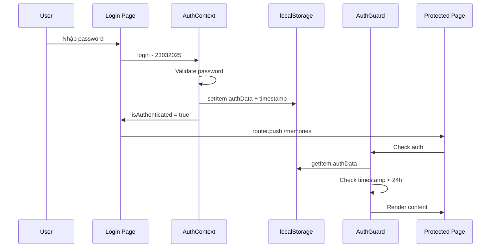

# 🏗️ Kiến Trúc Next.js - Bằng & Duyên Memories

> Tài liệu thiết kế kiến trúc chuyển đổi website HTML tĩnh sang Next.js 14+ App Router

---

## 1. Tổng Quan

### 1.1 Mục tiêu
- Chuyển đổi 14 trang HTML tĩnh sang Next.js App Router
- Giữ nguyên toàn bộ CSS animations hiện tại (CSS Modules, KHÔNG Tailwind)
- Deploy trên Vercel
- Tối ưu performance với Next.js Image, lazy loading
- Tổ chức code dạng component-based, dễ maintain

### 1.2 Tech Stack
| Layer | Technology |
|-------|-----------|
| Framework | Next.js 14+ (App Router) |
| Language | TypeScript |
| Styling | CSS Modules (giữ nguyên CSS hiện tại) |
| Fonts | Google Fonts via `next/font` |
| Icons | Font Awesome 6.4 (CDN hoặc `@fortawesome/react-fontawesome`) |
| Images | `next/image` với optimize |
| State | React Context (Auth) + useState/useReducer (local) |
| Data | Static JSON import + Client-side fetch |
| Deploy | Vercel |

---

## 2. Cấu Trúc Thư Mục

```
nextjs-app/
├── public/
│   ├── data/
│   │   ├── memories.json              # Copy nguyên từ data/memories.json
│   │   ├── images/                    # Copy nguyên từ data/images/
│   │   ├── audio/                     # Copy nguyên từ data/audio/
│   │   ├── music/                     # Copy nguyên từ data/music/
│   │   ├── videos/                    # Copy nguyên từ data/videos/
│   │   └── gif/                       # Copy nguyên từ data/gif/
│   ├── christmas/                     # Copy từ cong-chua-iuuu-cua-a/
│   │   ├── audio.mp3
│   │   └── image1-11.jpg
│   └── favicon.ico
│
├── src/
│   ├── app/
│   │   ├── layout.tsx                 # Root layout (fonts, metadata, AuthProvider)
│   │   ├── globals.css                # CSS reset + shared CSS variables
│   │   ├── page.tsx                   # Login page (/)
│   │   ├── page.module.css            # Login page CSS
│   │   │
│   │   ├── (protected)/               # Route group - tất cả trang cần auth
│   │   │   ├── layout.tsx             # Protected layout (AuthGuard + Navigation + MusicPlayer)
│   │   │   ├── layout.module.css
│   │   │   │
│   │   │   ├── memories/
│   │   │   │   ├── page.tsx           # Trang kỷ niệm chính
│   │   │   │   └── page.module.css    # Copy từ memories.css
│   │   │   │
│   │   │   ├── gallery/
│   │   │   │   ├── page.tsx           # Thư viện ảnh
│   │   │   │   └── page.module.css    # Copy từ gallery.css
│   │   │   │
│   │   │   ├── timeline/
│   │   │   │   ├── page.tsx           # Đếm ngày yêu
│   │   │   │   └── page.module.css    # Copy từ timeline.css
│   │   │   │
│   │   │   ├── starmap/
│   │   │   │   ├── page.tsx           # Bản đồ sao
│   │   │   │   └── page.module.css    # Copy từ starmap.css
│   │   │   │
│   │   │   ├── 100days/
│   │   │   │   ├── page.tsx           # 100 ngày yêu
│   │   │   │   └── page.module.css    # Copy từ 100days.css
│   │   │   │
│   │   │   ├── 300days/
│   │   │   │   ├── page.tsx           # 300 ngày yêu
│   │   │   │   └── page.module.css    # Copy từ 300days.css
│   │   │   │
│   │   │   ├── 1year/
│   │   │   │   ├── page.tsx           # 1 năm yêu
│   │   │   │   └── page.module.css    # Copy từ 1year.css
│   │   │   │
│   │   │   ├── birthday/
│   │   │   │   ├── page.tsx           # Sinh nhật
│   │   │   │   └── page.module.css    # Copy từ birthday.css
│   │   │   │
│   │   │   ├── sorry/
│   │   │   │   ├── page.tsx           # Xin lỗi
│   │   │   │   └── page.module.css    # Copy từ sorry.css
│   │   │   │
│   │   │   ├── march8/
│   │   │   │   ├── page.tsx           # 8/3
│   │   │   │   └── page.module.css    # Copy từ march8.css
│   │   │   │
│   │   │   ├── trung-thu/
│   │   │   │   ├── page.tsx           # Trung thu
│   │   │   │   └── page.module.css    # Copy từ trung-thu.css
│   │   │   │
│   │   │   ├── giang-sinh/
│   │   │   │   ├── page.tsx           # Giáng sinh
│   │   │   │   └── page.module.css    # Extract từ giang_sinh_an_lanh.html inline styles
│   │   │   │
│   │   │   └── admin/
│   │   │       ├── page.tsx           # Quản lý
│   │   │       └── page.module.css    # Copy từ admin.css
│   │   │
│   │   └── api/
│   │       └── memories/
│   │           └── route.ts           # (Optional) API route cho memories CRUD nếu cần
│   │
│   ├── components/
│   │   ├── layout/
│   │   │   ├── Navigation.tsx         # Thanh navigation chung
│   │   │   ├── Navigation.module.css
│   │   │   ├── MusicPlayer.tsx        # Music player floating
│   │   │   └── MusicPlayer.module.css
│   │   │
│   │   ├── features/
│   │   │   ├── auth/
│   │   │   │   ├── AuthGuard.tsx      # Client component bảo vệ trang
│   │   │   │   ├── LoginForm.tsx      # Form đăng nhập
│   │   │   │   └── LoginForm.module.css
│   │   │   │
│   │   │   ├── memories/
│   │   │   │   ├── MemoryCard.tsx     # Card hiển thị 1 memory
│   │   │   │   ├── MemoryCard.module.css
│   │   │   │   ├── MemoryGrid.tsx     # Grid chứa nhiều cards
│   │   │   │   ├── MemoryGrid.module.css
│   │   │   │   ├── MemoryModal.tsx    # Modal xem chi tiết
│   │   │   │   ├── MemoryModal.module.css
│   │   │   │   └── FilterBar.tsx      # Bộ lọc category
│   │   │   │
│   │   │   └── gallery/
│   │   │       ├── ImageGrid.tsx      # Grid ảnh
│   │   │       ├── ImageGrid.module.css
│   │   │       ├── Lightbox.tsx       # Lightbox xem ảnh lớn
│   │   │       └── Lightbox.module.css
│   │   │
│   │   └── ui/
│   │       ├── BackgroundAnimation.tsx      # Background animation wrapper
│   │       ├── BackgroundAnimation.module.css
│   │       ├── FloatingHearts.tsx           # Hearts animation
│   │       ├── FloatingHearts.module.css
│   │       ├── FloatingParticles.tsx        # Particles effect
│   │       ├── FloatingParticles.module.css
│   │       ├── Sparkles.tsx                 # Sparkle effect
│   │       ├── Sparkles.module.css
│   │       ├── LoadingScreen.tsx            # Loading screen
│   │       └── LoadingScreen.module.css
│   │
│   ├── contexts/
│   │   └── AuthContext.tsx            # React Context cho authentication state
│   │
│   ├── hooks/
│   │   ├── useAuth.ts                 # Hook truy cập auth context
│   │   ├── useMemories.ts            # Hook load + filter memories
│   │   └── useMusicPlayer.ts         # Hook điều khiển music player
│   │
│   ├── lib/
│   │   ├── constants.ts              # Hằng số (passwords, playlist, nav items)
│   │   └── utils.ts                  # Utility functions (formatDate, escapeHtml, etc.)
│   │
│   └── types/
│       ├── memory.ts                  # Interface Memory, Category, etc.
│       └── music.ts                   # Interface Track, Playlist
│
├── next.config.ts
├── tsconfig.json
├── package.json
└── vercel.json                        # Vercel deployment config
```

---

## 3. Route Mapping

| # | HTML gốc | Next.js Route | Loại | Ghi chú |
|---|----------|---------------|------|---------|
| 1 | `index.html` | `/` | Public | Trang login, không cần auth |
| 2 | `memories.html` | `/memories` | Protected | Trang chính, load data từ JSON |
| 3 | `gallery.html` | `/gallery` | Protected | Load ảnh từ `/public/data/images/` |
| 4 | `timeline.html` | `/timeline` | Protected | Đếm ngày yêu (tính toán client-side) |
| 5 | `starmap.html` | `/starmap` | Protected | Canvas-based star map |
| 6 | `100days.html` | `/100days` | Protected | Event page - 100 ngày |
| 7 | `300days.html` | `/300days` | Protected | Event page - 300 ngày |
| 8 | `1year.html` | `/1year` | Protected | Event page - 1 năm (có music player) |
| 9 | `birthday.html` | `/birthday` | Protected | Event page - sinh nhật |
| 10 | `sorry.html` | `/sorry` | Protected | Event page - xin lỗi |
| 11 | `march8.html` | `/march8` | Protected | Event page - 8/3 (có music player) |
| 12 | `trung-thu.html` | `/trung-thu` | Protected | Event page - trung thu |
| 13 | `giang_sinh_an_lanh.html` | `/giang-sinh` | Protected | Event page - giáng sinh |
| 14 | `admin.html` | `/admin` | Protected | Quản lý memories |

---

## 4. Authentication Strategy

### 4.1 Approach: Client-side Auth với React Context

Giữ nguyên localStorage approach (không cần backend), nhưng tổ chức lại bằng React patterns:

```
Luồng Authentication:
                                     
  User nhập password ──> AuthContext.login()
         │                      │
         │              Kiểm tra password
         │              "23032025" || "2332025"
         │                      │
         ├── Sai ──> Hiển thị error + shake animation
         │
         └── Đúng ──> localStorage.setItem authData
                       với timestamp
                              │
                       router.push /memories
```

### 4.2 Component Flow

```
  src/app/layout.tsx
       │
       └── <AuthProvider>            ← Wrap toàn bộ app
              │
              ├── / (login page)     ← Public, kiểm tra nếu đã auth -> redirect /memories
              │
              └── /(protected)/layout.tsx
                     │
                     └── <AuthGuard>  ← Client Component, kiểm tra localStorage
                            │
                            ├── Chưa auth ──> redirect /
                            ├── Hết hạn 24h ──> clear + redirect /
                            └── Đã auth ──> render children
                                   │
                                   ├── <Navigation />
                                   ├── <MusicPlayer />
                                   └── {children}  ← Page content
```

### 4.3 AuthContext Interface

```typescript
interface AuthContextType {
  isAuthenticated: boolean;
  isLoading: boolean;           // Tránh flash of content
  login: (password: string) => boolean;
  logout: () => void;
  refreshSession: () => void;
  getRemainingTime: () => number; // Phút còn lại
}
```

### 4.4 Tại sao KHÔNG dùng Next.js Middleware?

- Authentication dựa trên localStorage (client-side only)
- Next.js Middleware chạy ở Edge Runtime, không có access vào localStorage
- Middleware phù hợp cho cookie/JWT-based auth
- Giải pháp: Dùng `AuthGuard` client component với loading state để tránh flash

---

## 5. Component Hierarchy

```
<RootLayout>                           ← src/app/layout.tsx
│  Fonts: Poppins, Dancing Script, Playfair Display
│  Metadata, AuthProvider
│
├── / (Login)                          ← src/app/page.tsx - use client
│   ├── <BackgroundAnimation variant="login" />
│   │   └── <FloatingHearts emoji />
│   └── <LoginForm />
│
└── /(protected)                       ← Route Group
    └── <ProtectedLayout>              ← src/app/(protected)/layout.tsx - use client
        ├── <AuthGuard>
        ├── <Navigation items={navItems} />
        ├── <MusicPlayer playlist={playlist} />
        │
        ├── /memories
        │   ├── <BackgroundAnimation variant="memories" />
        │   ├── <FilterBar />
        │   ├── <MemoryGrid>
        │   │   └── <MemoryCard /> ×N
        │   └── <MemoryModal />
        │
        ├── /gallery
        │   ├── <BackgroundAnimation variant="gallery" />
        │   ├── <ImageGrid>
        │   │   └── next/image ×N
        │   └── <Lightbox />
        │
        ├── /timeline
        │   └── <BackgroundAnimation variant="timeline" />
        │       + Page-specific content
        │
        ├── /starmap
        │   └── <BackgroundAnimation variant="starmap" />
        │       + Canvas star map
        │
        ├── /100days, /300days, /1year,
        │   /birthday, /sorry, /march8,
        │   /trung-thu, /giang-sinh
        │   └── <BackgroundAnimation variant="..." />
        │       + Mỗi trang có content + animation riêng
        │
        └── /admin
            └── Admin panel (CRUD memories)
```

---

## 6. CSS Strategy

### 6.1 Approach: CSS Modules - Copy + Adapt

**Nguyên tắc:** Giữ nguyên CSS hiện tại càng nhiều càng tốt, chỉ thay đổi tối thiểu.

### 6.2 Quy trình chuyển đổi CSS

| Bước | Hành động | Ví dụ |
|------|-----------|-------|
| 1 | Copy file `.css` gốc | `memories.css` → `page.module.css` |
| 2 | Thay class selectors bằng module syntax | `.memories-grid` → dùng `styles.memoriesGrid` trong JSX |
| 3 | Giữ nguyên `@keyframes` | Keyframes hoạt động bình thường trong CSS Modules |
| 4 | Extract CSS chung vào `globals.css` | CSS variables, font-face, reset |
| 5 | CSS inline (index.html) → tạo file `.module.css` riêng | Login page styles |

### 6.3 globals.css - CSS chung

```css
/* globals.css sẽ chứa: */

/* 1. CSS Reset */
* { margin: 0; padding: 0; box-sizing: border-box; }

/* 2. CSS Variables - theme colors dùng chung */
:root {
  --pink-primary: #e91e63;
  --pink-light: #ff69b4;
  --pink-bg: #ffeef2;
  --pink-bg-mid: #ffe0e6;
  --pink-bg-dark: #ffd1dc;
  --gradient-bg: linear-gradient(135deg, var(--pink-bg) 0%, var(--pink-bg-mid) 50%, var(--pink-bg-dark) 100%);
}

/* 3. Font Awesome CDN hoặc local import */
```

### 6.4 Xử lý CSS đặc biệt

| Vấn đề | Giải pháp |
|--------|-----------|
| CSS dùng element selectors (`body`, `h1`) | Wrap trong parent class hoặc chuyển vào globals.css |
| `:nth-child()` selectors | Hoạt động bình thường trong CSS Modules |
| CSS custom properties (`--delay`, `--x`) | Hoạt động bình thường |
| `@keyframes` | Tự động scoped trong CSS Modules |
| Inline styles trong HTML (gradient nav buttons) | Giữ nguyên dưới dạng React inline style |

---

## 7. Data Flow

### 7.1 Memories Data

```
  public/data/memories.json
         │
         │  fetch /data/memories.json
         ▼
  useMemories hook (client-side)
         │
         ├── memories: Memory[]
         ├── categories: Record<string, Category>
         ├── currentFilter: string
         ├── currentPage: number
         │
         ▼
  <MemoryGrid>
         │
         └── <MemoryCard> ×N
                │
                └── onClick ──> <MemoryModal>
```

### 7.2 Gallery Images

```
  Cách 1 - Static: Import list ảnh thủ công trong code
  Cách 2 - Dynamic: API route scan /public/data/images/
  
  Khuyến nghị: Cách 2 vì có 100+ ảnh
  
  /api/images/route.ts ──> scan public/data/images/
         │                    (build-time hoặc runtime)
         ▼
  useGalleryImages hook
         │
         ▼
  <ImageGrid>
         │
         └── <Image> (next/image) ×N
                │
                └── onClick ──> <Lightbox>
```

### 7.3 Music Player

```
  src/lib/constants.ts
         │
         │  playlist: Track[]
         │  [bang-duyen-1, 4, 5, 6, 7, 8, 365]
         ▼
  useMusicPlayer hook
         │
         ├── currentTrack: Track
         ├── isPlaying: boolean
         ├── play / pause / next / prev
         │
         ▼
  <MusicPlayer>  (floating, persistent across pages)
         │
         └── <audio> element
```

---

## 8. TypeScript Interfaces

### 8.1 Memory Types

```typescript
// src/types/memory.ts

interface Memory {
  id: number;
  title: string;
  date: string;          // "2025-02-08" format
  category: MemoryCategory;
  content: string;
  mood: string;
  template: string;
  showImages: boolean;
  images: string[];
}

type MemoryCategory = 'milestone' | 'dating' | 'daily' | 'quotes';

interface CategoryInfo {
  name: string;
  icon: string;
  description: string;
}

interface MemoriesData {
  memories: Memory[];
  categories: Record<MemoryCategory, CategoryInfo>;
}
```

### 8.2 Music Types

```typescript
// src/types/music.ts

interface Track {
  src: string;           // "/data/music/bang-duyen-7.mp3"
  name: string;          // "Duyên Mình Là Mãi Mãi (v7)"
}
```

### 8.3 Auth Types

```typescript
// src/types/auth.ts (hoặc trong AuthContext)

interface AuthData {
  authenticated: boolean;
  timestamp: number;     // Date.getTime()
}
```

---

## 9. Navigation Items Config

```typescript
// src/lib/constants.ts

interface NavItem {
  href: string;
  icon: string;
  label: string;
  isSpecial?: boolean;
  gradient?: string;
}

const NAV_ITEMS: NavItem[] = [
  { href: '/memories', icon: 'fas fa-heart', label: 'Kỷ Niệm' },
  { href: '/gallery', icon: 'fas fa-images', label: 'Thư viện ảnh' },
  { href: '/timeline', icon: 'fas fa-clock', label: 'Đếm Ngày' },
  { href: '/starmap', icon: 'fas fa-star', label: 'Bản Đồ Sao' },
  { href: '/100days', icon: 'fas fa-crown', label: '100 Ngày Yêu', isSpecial: true },
  { href: '/300days', icon: 'fas fa-gem', label: '300 Ngày Yêu', isSpecial: true,
    gradient: 'linear-gradient(135deg, #B76E79 0%, #E75480 50%, #FF6B6B 100%)' },
  { href: '/trung-thu', icon: 'fas fa-moon', label: 'Tết Trung Thu', isSpecial: true,
    gradient: 'linear-gradient(135deg, #FFD700 0%, #FF6347 50%, #FF69B4 100%)' },
  { href: '/birthday', icon: 'fas fa-birthday-cake', label: 'Sinh Nhật', isSpecial: true,
    gradient: 'linear-gradient(135deg, #FF69B4 0%, #FFD700 50%, #FF1493 100%)' },
  { href: '/sorry', icon: 'fas fa-heart-broken', label: 'Xin Lỗi Eiuuu',
    gradient: 'linear-gradient(135deg, #87CEEB 0%, #DDA0DD 50%, #F0E68C 100%)' },
  { href: '/giang-sinh', icon: 'fas fa-tree', label: 'Giáng Sinh', isSpecial: true,
    gradient: 'linear-gradient(135deg, #DC143C 0%, #228B22 50%, #FFD700 100%)' },
  { href: '/march8', icon: 'fas fa-seedling', label: '8/3 Ngày Của Em', isSpecial: true,
    gradient: 'linear-gradient(135deg, #ff6b9d 0%, #a29bfe 50%, #fd79a8 100%)' },
  { href: '/1year', icon: 'fas fa-trophy', label: '1 Năm Iuuu', isSpecial: true,
    gradient: 'linear-gradient(135deg, #FFD700 0%, #FF1493 50%, #FF69B4 100%)' },
];
```

---

## 10. Static Assets Organization

### 10.1 Mapping

| Thư mục gốc | Thư mục Next.js (`public/`) | Ghi chú |
|-------------|---------------------------|---------|
| `data/memories.json` | `public/data/memories.json` | Giữ nguyên path |
| `data/images/` | `public/data/images/` | 100+ ảnh, giữ nguyên tên |
| `data/audio/` | `public/data/audio/` | Audio files |
| `data/music/` | `public/data/music/` | 7 bài MP3 |
| `data/videos/` | `public/data/videos/` | Video files |
| `data/gif/` | `public/data/gif/` | GIF files |
| `cong-chua-iuuu-cua-a/` | `public/christmas/` | Rename rõ ràng hơn |

### 10.2 Image Optimization

- Dùng `next/image` cho gallery images
- Config `next.config.ts` để allow local images từ `/public/data/images/`
- Ảnh trong event pages: giữ nguyên với `` nếu CSS phức tạp, hoặc dùng `next/image` với `unoptimized` prop

---

## 11. Vercel Deployment Config

```json
// vercel.json
{
  "framework": "nextjs",
  "buildCommand": "next build",
  "outputDirectory": ".next"
}
```

```typescript
// next.config.ts
import type { NextConfig } from 'next';

const nextConfig: NextConfig = {
  // Cho phép next/image load ảnh local
  images: {
    unoptimized: false,
    remotePatterns: [],
  },
  // Redirect từ old URLs (nếu cần backward compatibility)
  async redirects() {
    return [
      { source: '/memories.html', destination: '/memories', permanent: true },
      { source: '/gallery.html', destination: '/gallery', permanent: true },
      { source: '/timeline.html', destination: '/timeline', permanent: true },
      { source: '/starmap.html', destination: '/starmap', permanent: true },
      { source: '/100days.html', destination: '/100days', permanent: true },
      { source: '/300days.html', destination: '/300days', permanent: true },
      { source: '/1year.html', destination: '/1year', permanent: true },
      { source: '/birthday.html', destination: '/birthday', permanent: true },
      { source: '/sorry.html', destination: '/sorry', permanent: true },
      { source: '/march8.html', destination: '/march8', permanent: true },
      { source: '/trung-thu.html', destination: '/trung-thu', permanent: true },
      { source: '/admin.html', destination: '/admin', permanent: true },
      {
        source: '/cong-chua-iuuu-cua-a/giang_sinh_an_lanh.html',
        destination: '/giang-sinh',
        permanent: true,
      },
      { source: '/index.html', destination: '/', permanent: true },
    ];
  },
};

export default nextConfig;
```

---

## 12. Background Animation Strategy

Mỗi trang có background animation riêng với CSS khác nhau. Phân loại:

| Variant | Trang sử dụng | Elements |
|---------|---------------|----------|
| `login` | `/` | Floating heart emojis + sparkles |
| `memories` | `/memories` | Gradient BG + hearts + particles + circuit lines + tech icons + sparkles |
| `gallery` | `/gallery` | Hearts + petals + gradient orbs + sparkles |
| `timeline` | `/timeline` | Floating hearts |
| `starmap` | `/starmap` | Floating hearts (dark theme) |
| `events` | `/100days, /300days` | Gradient BG + hearts + particles + sparkles |
| `sorry` | `/sorry` | Gradient BG + custom |
| `trung-thu` | `/trung-thu` | Moon BG + custom |
| `admin` | `/admin` | Floating hearts |

**Approach:** Mỗi trang tự render background animation trong page component, KHÔNG abstract thành 1 component chung - vì CSS quá khác nhau giữa các trang. Tuy nhiên, có thể tạo các atomic components (`FloatingHearts`, `FloatingParticles`, `Sparkles`) để compose.

---

## 13. Implementation Order

### Phase 1: Foundation
1. Khởi tạo Next.js project với TypeScript
2. Setup `globals.css` (reset + CSS variables)
3. Setup fonts qua `next/font`
4. Copy static assets vào `public/`
5. Tạo TypeScript interfaces (`types/`)
6. Tạo constants (`lib/constants.ts`)
7. Tạo utility functions (`lib/utils.ts`)

### Phase 2: Authentication
8. Tạo `AuthContext` + `useAuth` hook
9. Tạo `AuthGuard` component
10. Tạo Login page (`/`) với CSS

### Phase 3: Layout + Shared Components
11. Tạo `Navigation` component
12. Tạo `MusicPlayer` component + `useMusicPlayer` hook
13. Tạo Protected layout (`(protected)/layout.tsx`)
14. Tạo `BackgroundAnimation` atomic components

### Phase 4: Core Pages
15. Tạo `/memories` page (quan trọng nhất)
    - `MemoryCard`, `MemoryGrid`, `MemoryModal`, `FilterBar`
    - `useMemories` hook
16. Tạo `/gallery` page
    - `ImageGrid`, `Lightbox`
17. Tạo `/timeline` page

### Phase 5: Feature Pages
18. Tạo `/starmap` page
19. Tạo `/100days` page
20. Tạo `/300days` page
21. Tạo `/1year` page
22. Tạo `/birthday` page
23. Tạo `/sorry` page
24. Tạo `/march8` page
25. Tạo `/trung-thu` page
26. Tạo `/giang-sinh` page

### Phase 6: Admin + Polish
27. Tạo `/admin` page
28. Config `next.config.ts` (redirects, images)
29. Testing trên Vercel preview
30. Performance optimization (lazy loading, image sizes)

---

## 14. Quyết Định Thiết Kế Quan Trọng

### 14.1 Client Components vs Server Components

| Component | Rendering | Lý do |
|-----------|-----------|-------|
| Root Layout | Server | Chỉ cần wrap providers |
| Login Page | Client (`use client`) | Cần DOM interaction, localStorage |
| Protected Layout | Client (`use client`) | AuthGuard cần localStorage |
| Navigation | Client (`use client`) | Cần `usePathname` cho active state |
| MusicPlayer | Client (`use client`) | Cần Audio API, state |
| Memory pages | Client (`use client`) | Cần fetch data, filter, modal |
| Event pages | Client (`use client`) | Cần animations, DOM interaction |

> **Lưu ý:** Hầu hết trang đều là Client Components vì tính chất interactive cao. Server Components chỉ dùng cho Root Layout.

### 14.2 Tại sao không dùng Tailwind?
- CSS hiện tại có 100+ custom `@keyframes` animations
- Mỗi trang có theme CSS riêng biệt (colors, gradients, effects)
- Chuyển sang Tailwind sẽ mất rất nhiều effort và dễ break animations
- CSS Modules giữ nguyên scoping tương tự mà không cần refactor

### 14.3 Music Player Persistence
- Music Player nằm trong Protected Layout → persist khi navigate giữa các trang protected
- Dùng `useRef` cho Audio element để tránh re-create
- State lưu trong `useMusicPlayer` hook (current track, playing state)
- Khi navigate, layout không unmount → music tiếp tục phát

### 14.4 Gallery Images Loading
- 100+ ảnh không thể import static
- Dùng API route (`/api/images`) để list files từ `public/data/images/` ở build time
- Hoặc hardcode danh sách ảnh trong 1 file config (đơn giản hơn)
- `next/image` với lazy loading cho performance

---

## 15. Diagrams

### 15.1 Application Architecture

```mermaid
graph TB
    subgraph Client Browser
        A[User] --> B[Login Page /]
        B -->|Authenticated| C[Protected Layout]
        C --> D[Navigation]
        C --> E[Music Player]
        C --> F[Page Content]
        F --> G[/memories]
        F --> H[/gallery]
        F --> I[/timeline]
        F --> J[/starmap]
        F --> K[Event Pages x8]
        F --> L[/admin]
    end
    
    subgraph Data Layer
        M[localStorage - AuthData]
        N[public/data/memories.json]
        O[public/data/images/]
        P[public/data/music/]
    end
    
    B -.->|Read/Write| M
    C -.->|Check| M
    G -.->|Fetch| N
    H -.->|Load| O
    E -.->|Stream| P
```

### 15.2 Authentication Flow



---

## 16. Package Dependencies

```json
{
  "dependencies": {
    "next": "^14.2.0",
    "react": "^18.2.0",
    "react-dom": "^18.2.0",
    "@fortawesome/fontawesome-svg-core": "^6.4.0",
    "@fortawesome/free-solid-svg-icons": "^6.4.0",
    "@fortawesome/react-fontawesome": "^0.2.0"
  },
  "devDependencies": {
    "typescript": "^5.0.0",
    "@types/react": "^18.2.0",
    "@types/react-dom": "^18.2.0",
    "@types/node": "^20.0.0"
  }
}
```

> **Font Awesome:** Có 2 lựa chọn:
> 1. CDN trong `layout.tsx` (đơn giản, giống HTML gốc)
> 2. React components `@fortawesome/react-fontawesome` (tree-shaking, nhỏ hơn)
> 
> Khuyến nghị: Dùng CDN trước cho nhanh, optimize sau nếu cần.

---

## 17. Checklist Triển Khai

- [ ] `npx create-next-app@latest nextjs-app --typescript --app --no-tailwind --src-dir`
- [ ] Copy static assets vào `public/`
- [ ] Tạo `src/types/*.ts`
- [ ] Tạo `src/lib/constants.ts` + `utils.ts`
- [ ] Tạo `src/contexts/AuthContext.tsx`
- [ ] Tạo `src/hooks/useAuth.ts`
- [ ] Tạo `src/app/globals.css`
- [ ] Tạo `src/app/layout.tsx` (Root layout)
- [ ] Tạo `src/app/page.tsx` + `page.module.css` (Login)
- [ ] Tạo `src/components/features/auth/AuthGuard.tsx`
- [ ] Tạo `src/components/layout/Navigation.tsx` + CSS
- [ ] Tạo `src/components/layout/MusicPlayer.tsx` + `useMusicPlayer` hook
- [ ] Tạo `src/app/(protected)/layout.tsx`
- [ ] Tạo `/memories` page + components
- [ ] Tạo `/gallery` page + components
- [ ] Tạo `/timeline` page
- [ ] Tạo `/starmap` page
- [ ] Tạo 8 event pages (100days, 300days, 1year, birthday, sorry, march8, trung-thu, giang-sinh)
- [ ] Tạo `/admin` page
- [ ] Config `next.config.ts`
- [ ] Test local + Vercel preview deploy
